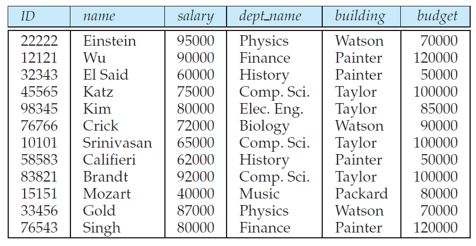

## The First Chapter ： Introduction

### 摘要(abstract)

了解一些数据库的基础概念和名词，数据库设计的目标以及面临的问题；数据如何被抽象为三个层级；实例跟模式有什么区别；有哪些基本的数据模型；数据库语言有哪几类，每种数据库语言功能是什么；数据库设计分为几个阶段；存储系统被分为几个模块，每个模块的功能与相互的联系；数据挖掘与信息提取；特殊类型的数据库与数据模型；数据库发展历史。

### 1. Purpose of Database system

在数据库蓬勃发展前，当面临一些应用场景：企业信息管理，银行交易系统，学生信息管理时， 当没有数据库时，在需要存储数据时往往存在操作系统的文件里，此时就需要编不同程序来应对不同的应用需求，从众多的文件里提取(exact)，增加，删除，更新有效信息。这样的系统叫做(file processing system)，它的缺点如下

- data redundancy and inconsistency 因为系统维护时间一长，用各种语言编写的不同的程序不可避免的会使得同一个record记录被记录在不同的几个文件中，而在增删查改的过程中可能只修改了一部分记录，而修改的记录就和没有修改的记录不一致。例如：一个学生修了美术和建筑，他的记录被美术学院和建筑学院分别存了一次(redundancy)，会导致存储开销和访问开销，当学生联系方式改变了，有可能只在他主修的美术学院的记录中更改了联系方式，而其他记录并没有改变(inconsistency)
- Difficult to access data :当产生新的应用需求时，往往需要重新编写程序。
- Data isolation: 数据被不同程序存储在不同文件，提取跨表的数据会相当困难
- Integrity problems:当一些规定限制条件(consistency constraints)改变时，所有程序都需要修改。
- Atomicity problem:转账时断电，一边扣钱，一边没有到账，这是不允许的。原子性，要求要不都不做要不全做。
- Concurrent access anomalies:当多个线程对同一个记录修改时可能会出现并发控制问题，例如 抢票，两个线程都读到还有一张票，两个人抢到一张票。
- Security problems.难以为访问系统的人员设置权限

### 2. View of Data

#### 2.1 Data abstraction

数据库提供给用户的只是一个抽象的数据的概念，隐藏了具体的存储（逻辑，物理）方式和发访问过程。数据库系统通过三层抽象，简化用户的使用难度。

- physical level 

  For database developer 数据到底咋存的，以什么结构存（线性表，hash表，B+ tree），存在哪

- logical level

  For administers 用简单的结构描述了什么数据存在数据库里，它们的内在联系，类似于关系数据库create的表项

  ```
  type instructor = record
  	ID : char (5);
  	name : char (20);
  	dept name : char (20);
  	salary : numeric (8,2);
  end;
  ```

- view level

  For user 把部分对于特定用户有用的信息呈现给用户


#### 2.2  Instances and Scheme

模式类似于定义好的变量，他的长度，类型，约束都已经定义好了。而实例是程序执行时某一刻变量里的value。

定义如下：

- Instances ：The collection of information stored in the database at a particular moment

- scheme： The overall design of the database

根据2.1的三层抽象，scheme分为两种 physical scheme ，logical scheme分别代表，物理层的设计与逻辑层的设计

- physical scheme ： the physical design of the database
- logical scheme ： the logical design of the database

#### 2.3 Data Models

数据模型是数据库设计的核心，他影响着数据库设计的方方面面。无论是物理层，逻辑层还是用户视角层。

- relational model

  数据库普遍使用的模型，很多经典的数据库都使用关系模型，用表的集合来表现数据的关系和属性

- entity-relationship model

  简称E-R模型 entity是object or thing是独一无二的对象，描述对象间的关系。

- object-based data model

  增加了封装，function的ER模型的扩展。

- Semistructured data model

  相比于关系数据模型，每一行的属性可以各不相同，常用于存储格式类似于XML的数据。

上述的各个数据模式会在与之相关的章节详细理清。

### 3. Database Language

- data definition language(DDL)

  建立约束和定义 ，举例：sql里的create建立了一个table的scheme

  1. Domain constraints: table的每个属性的取值范围类型
  2. Referential Integrity：引用完整性，表项里有些属性的值必须满足一定约束，举例：没有物理学院你不能开设物理课。
  3. Assertions.上述两种也属于Assertions,涵盖面更广，举例：每个学院至少有五门课
  4. Authorization.权限控制，插入，更改，删除，访问权限授予指定用户

- data manipulation language(DML)

  完成用户的增删查改任务

### 4. Database Design

#### 4.1 Design process

1. 明确需求(requirement)
2. 选择数据模型(data model)
3. 概念设计(conceptual design) 决定需要哪些属性，根据用户需求设计每个表
4. 逻辑设计(logical)概念模式映射到相应data model上 
5. 物理设计(physical) design file organization and inner storage structure

#### 4.2 E-R diagram

在ER数据模型中，通过画出E-R图来完成数据库设计中的概念设计步骤；mapping cardinalities,决定了实体间的映射关系，(1 : 1;1 : n;n : n)


#### 4.3 Normalization

在设计关系型数据库时，通过归一化的方法保证各个表之间没有不必要冗余，保证查询的效率。

没有归一化的bad design有两个特点：

- 重复的信息(Repetition of information)

  学院的预算与员工并没有关系，但它在每个相同学院员工的记录里都出现了，这是冗余的。浪费了空间，同时，当修改指定学院预算的时候，该学院的每个员工的记录都需要修改

- 无法表示特定信息(Inability to represent certain information)

  当我们新开设一个学院的时候，由于该学院没有老师，我们无法记录有关该学院的预算情况直到雇佣到一个老师，这是难以接受的



### 5. Data Storage and Querying

数据库系统分为两个模块来维持整个系统运作，粗略的分为两个部件：存储管理器(storage manager)和查询处理器(query processor)

#### 5.1 Storage Manager

**Definition**: translate the DML to the commend of the file system(file manager),updating,retrieving,storeing data in database.  In the physical level

- Authorization and integrity manager: 检查用户认证，检查约束和断言有没有被破坏。
- Transaction manager: 事务并发无冲突，系统宕机可恢复，使得事务满足ACID特性。
- File manager：物理上文件组织的数据结构，空间划分。
- Buffer manager：什么时候预取数据，什么时候将数据刷新回磁盘，数据库重要的模块

存储管理器，管理这以下三种文件类型

- Data files：存储具体的数据和记录
- Data dictionary：存储相应记录的源数据(metadata)，类似于c++中的指针
- Indices ：索引，类似于书本的目录，加快查询的速度。

#### 5.2 Query Processor

**Definition**： In the logical level,

- DDL interpreter : 解释DDL语句，在data dictionary中记录约束与定义
- DML compiler：翻译DML语句，生成最高效的查询计划交给查询引擎
- Query evaluation engine,：执行DML compiler的查询计划

### 6. Transaction Management

**Transaction Definition**： A collection of operations that performs a single logical function in a database application.

**事务的ACID**

- A(atomicity)原子性：事务要不发生了，要不没有发生，不允许中间状态
- C(consistency)一致性：类似于正确性，比如账户中的金钱，它可以减少，但必须在相应的别的账户增加，钱不可以凭空消失。
- I(isolation)隔离性：由于一些特定事务间有依赖性，如果穿行执行就不会出现冲突，这是隔离的最高等级Serializable序列化。但是由于事务需要并发来提高吞吐量，就出现了不同的隔离等级，他们分别是Repeated read，Read committed ，Read uncommitted。
- D(durability)持久性：由于数据存在内存中，如果服务器宕机，那易失的内存中的数据就丢失了，因此为了防止此类问题，需要把数据持久化到非易失的磁盘上去。

**Failure Recovery**： 当没有宕机没有网络问题没有介质故障的时候，原子性总是满足的，但这些故障是经常发生的，如何在故障后保持原子性，就需要考虑到故障恢复。发现故障，恢复数据库系统到故障前的状态。

**Concurrency-control** ：单个事务都可以保证一致性，但当事务并发时，一致性就无法轻易保证。数据库系统需要并发控制器来保证并发事务的一致性。

### 7. Database Architecture


数据库应用有两种结构，两层结构与三层结构。

- 两层结构里，用户通过查询语句远程调用数据库功能，例如JDBC,ODBC。

- 三层结构里，用户不会直接远程调用，而是在服务器后端与数据库交互。更适合于大型应用，于数据库交互的功能不会分散在各个客户端。

