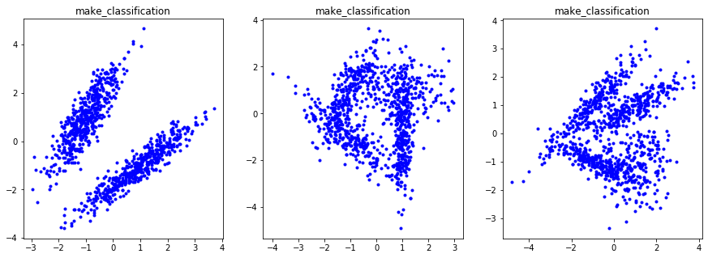
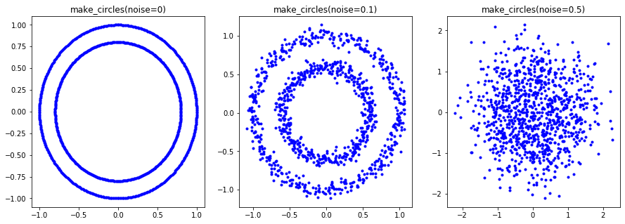
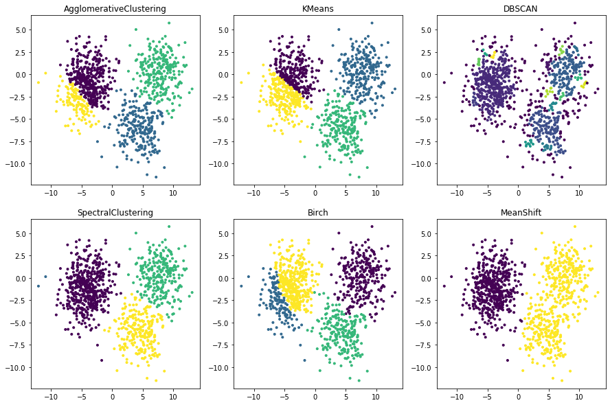
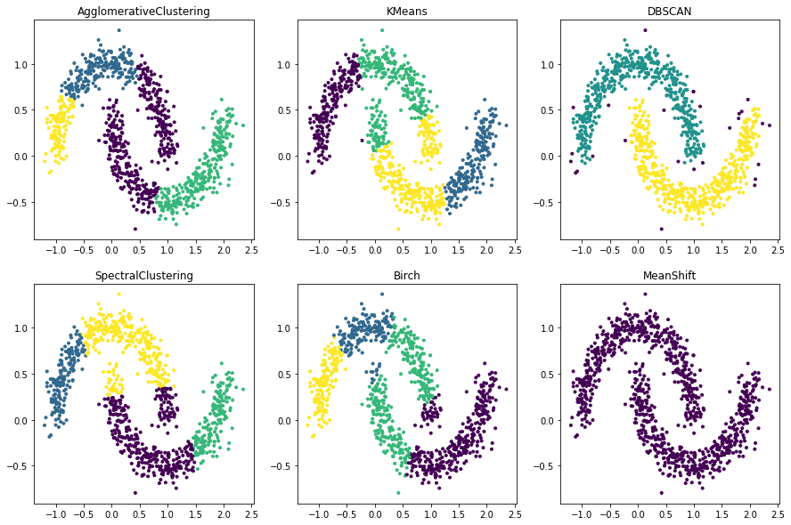
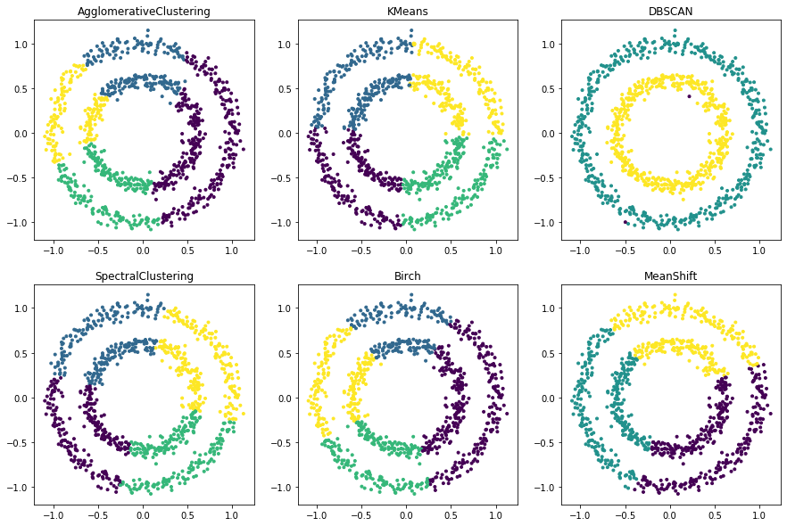
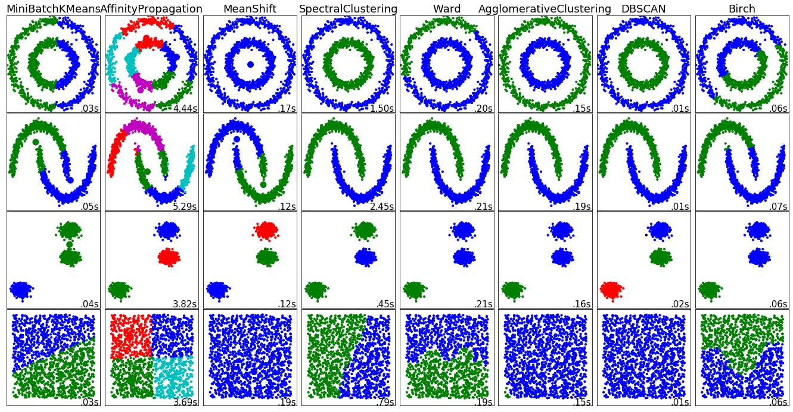

# 聚类应用篇

@Author: Howard Wonanut

@Date: 2020-01-07

[TOC]

## 1 概述

本专题重点在于使用sklearn进行聚类分析，不涉及聚类算法的原理介绍。

### 1.1 无监督学习与聚类算法

在机器学习当中，有相当一部分算法属于“无监督学习”，无监督算法在训练的时候只需要特征矩阵X，不需要标签。聚类算法就是无监督学习的代表算法。

聚类算法又叫“无监督分类”，其目的是将数据划分为有意义或者有用的组（簇）。这种划分可以基于业务的需求或者建模的需求来完成，也可以单纯的帮助我们探索数据的自然结构和分布。比如在商业中，如果我们的手头有大量的客户信息，我们可以使用聚类将客户划分为若干组，以便进一步分析和开展营销活动，最有名的客户价值判断模型RFM就常和聚类分析共同使用。再比如，聚类可以用于降维和矢量量化（vector quantization），可以将高位特征压缩到一列当中，常常用于图像，声音，视频等非结构化数据，可以大幅压缩数据量。

|          | 聚类                                                     | 分类                                                     |
| -------- | -------------------------------------------------------- | -------------------------------------------------------- |
| 核心     | 将数据分成多组<br>探索每个组的数据是否有联系             | 从已经分组的数据中去学习<br>把新数据放到已经分好的组中去 |
| 学习类型 | 无监督，不需要标签进行训练                               | 有监督，需要标签                                         |
| 典型算法 | K-Means, DBSCAN, 层次聚类， 谱聚类                       | 决策树， 贝叶斯， 逻辑回归， SVM                         |
| 算法输出 | 聚类的结果是不确定的<br>不一定总是能够反映数据的真实分类 | 分类结果是确定的<br>分类的优劣是客观的                   |


### 1.2 sklearn中常用的聚类算法

sklearn中的聚类算法有两种表现形式，一种是类，需要实例化，训练并使用接口和属性来调用。另一种是函数，只需要输入特征矩阵和超参数即可返回聚类的结果和各种指标，这里只介绍类。

| 类                              | 含义                         | 输入                               |
| ------------------------------- | ---------------------------- | ---------------------------------- |
| cluster.AffinityPropagation     | 执行亲和传播数据聚类         | [damping, ...]                     |
| cluster.AgglomerativeClustering | 凝聚聚类                     | [...]                              |
| cluster.Birch                   | Birch聚类算法                | [threshold, branching_factor, ...] |
| cluster.DBSCAN                  | DBSCAN聚类算法               | [eps, min_samples, metrix, ...]    |
| cluster.FeatureAgglomeration    | 凝聚特征                     | [n_clusters, ...]                  |
| cluster.KMeans                  | K均值聚类                    | [n_clusters, init, n_init, ...]    |
| cluster.MiniBatchKMeans         | 小批量K均值聚类              | [n_clusters, init, ...]            |
| cluster.MeanShift               | 使用平坦核函数的平均移位聚类 | [bandwidth, seeds, ...]            |
| cluster.SpectralClustering      | 谱聚类                       | [n_clusters, ...]                  |

### 1.3 sklearn中聚类使用示例

以KMeans为例，在sklearn中进行聚类步骤如下：

#### 1.3.1 聚类示例

```python
from sklearn.datasets import make_blobs
from sklearn.cluster import KMeans

x = make_blobs(n_samples=1000, n_features=2, centers = 4, cluster_std=2.0)[0]
## 方式1：使用fit函数训练，然后调用cluster1.labels_得到每个数据对应的簇编号（0,1,2,...)
cluster1 = KMeans(n_clusters = 4, random_state=10).fit(x)
y_pred = cluster1.labels_

## 方式2：使用fit_predict直接获得每个数据对应簇编号
y_pred = KMeans(n_clusters = 4, random_state=10).fit_predit(x)

## 以上两个方法得到的结果完全一致。
```

#### 1.3.2 重要属性

- culster_centers_ - 簇心：返回每个簇心的坐标
- inertia - 总距离平方和：越小越好


## 2 sklearn中生成测试数据函数介绍

生成数据的函数主要有：`sklearn.datasets.make_classification`, `sklearn.datasets.make_circles`, `sklearn.datasets.make_moons`以及`sklearn.datasets.make_blobs`。这里简单介绍每一个函数，具体参数见官方文档。

### 2.1 make_classification

主要用来生成分类数据，用法示例：

```python
x = make_classification(n_samples=1000, n_features=2, n_informative=2, n_redundant=0, n_repeated=0, n_clusters_per_class=1)
```

示例：

```python
from sklearn.datasets import make_classification, make_circles, make_moons
import matplotlib.pyplot as plt
import numpy as np

fig = plt.figure(figsize=(15,5))
fig.add_subplot(1,3,1)
x = make_classification(n_samples=1000, n_features=2, n_informative=2, n_redundant=0, n_repeated=0, n_clusters_per_class=1)
plt.plot(x[0][:,0], x[0][:,1], 'b.')
plt.title('make_classification')

fig.add_subplot(1,3,2)
x = make_classification(n_samples=1000, n_features=2, n_informative=2, n_redundant=0, n_repeated=0, n_clusters_per_class=2)
plt.plot(x[0][:,0], x[0][:,1], 'b.')
plt.title('make_classification')

fig.add_subplot(1,3,3)
x = make_classification(n_samples=1000, n_features=2, n_informative=2, n_redundant=0, n_repeated=0, n_clusters_per_class=2)
plt.plot(x[0][:,0], x[0][:,1], 'b.')
plt.title('make_classification')
```



### 2.2 make_moons

用来生成月牙形数据，用法示例：

```python
x = make_moons(n_samples=1000, noise=0.1)
```

示例：

```python
from sklearn.datasets import make_moons
import matplotlib.pyplot as plt
import numpy as np

fig = plt.figure(figsize=(15,5))
fig.add_subplot(1,3,1)
x = make_moons(n_samples=1000, noise=0)
plt.plot(x[0][:,0], x[0][:,1], 'b.')
plt.title('Make_moons(noise=0)')

fig.add_subplot(1,3,2)
x = make_moons(n_samples=1000, noise=0.1)
plt.plot(x[0][:,0], x[0][:,1], 'b.')
plt.title('Make_moons(noise=0.1)')

fig.add_subplot(1,3,3)
x = make_moons(n_samples=1000, noise=0.5)
plt.plot(x[0][:,0], x[0][:,1], 'b.')
plt.title('Make_moons(noise=0.5)')
```


### 2.3 make_moons

用来生成环形数据，用法示例：

```python
x = make_circles(n_samples=1000, noise=0.05, factor=0.6)
```

示例：

```python
from sklearn.datasets import make_circles
import matplotlib.pyplot as plt
import numpy as np

fig = plt.figure(figsize=(15,5))
fig.add_subplot(1,3,1)
x = make_circles(n_samples=1000, noise=0)
plt.plot(x[0][:,0], x[0][:,1], 'b.')
plt.title('make_circles(noise=0)')

fig.add_subplot(1,3,2)
x = make_circles(n_samples=1000, noise=0.05, factor=0.6)
plt.plot(x[0][:,0], x[0][:,1], 'b.')
plt.title('make_circles(noise=0.1)')

fig.add_subplot(1,3,3)
x = make_circles(n_samples=1000, noise=0.5)
plt.plot(x[0][:,0], x[0][:,1], 'b.')
plt.title('make_circles(noise=0.5)')
```



### 2.4 make_blobs

用来生成簇数据，用法示例：

```python
x = make_blobs(n_samples=1000, n_features=2, centers = 3)
```

示例：

```python
from sklearn.datasets import make_blobs
import matplotlib.pyplot as plt
import numpy as np

fig = plt.figure(figsize=(15,5))
fig.add_subplot(1,3,1)
x = make_blobs(n_samples=1000, n_features=2, centers = 2)
plt.plot(x[0][:,0], x[0][:,1], 'b.')
plt.title('make_blobs')

fig.add_subplot(1,3,2)
x = make_blobs(n_samples=1000, n_features=2, centers = 3)
plt.plot(x[0][:,0], x[0][:,1], 'b.')
plt.title('make_blobs')

fig.add_subplot(1,3,3)
x = make_blobs(n_samples=1000, n_features=2, centers = 4)
plt.plot(x[0][:,0], x[0][:,1], 'b.')
plt.title('make_blobs')
```


## 3 使用sklearn聚类示例

使用常用的六个聚类算法，并将聚类结果使用PCA降维后可视化。

### 3.1 簇数据聚类

```python
from sklearn.datasets import make_circles
import matplotlib.pyplot as plt
import numpy as np
from sklearn.cluster import KMeans, DBSCAN, SpectralClustering, Birch, MeanShift, AgglomerativeClustering
from sklearn.decomposition import PCA
import pandas as pd

x = make_blobs(n_samples=1000, n_features=2, centers = 4, cluster_std=2.0)[0]
pca = PCA(n_components=2)
pca_result = pca.fit_transform(x)
fig = plt.figure(figsize=(15,10))

model = AgglomerativeClustering(n_clusters = 4)
y_pred = model.fit_predict(x)
fig.add_subplot(2,3,1)
plt.scatter(pca_result[:,0], pca_result[:,1], marker='.', c=y_pred)
plt.title('AgglomerativeClustering')

model = KMeans(n_clusters = 4, random_state=10)
y_pred = model.fit_predict(x)
fig.add_subplot(2,3,2)
plt.scatter(pca_result[:,0], pca_result[:,1], marker='.', c=y_pred)
plt.title('KMeans')

model = DBSCAN(eps=0.1)
model.fit(x)
y_pred = model.labels_
fig.add_subplot(2,3,3)
plt.scatter(pca_result[:,0], pca_result[:,1], marker='.', c=y_pred)
plt.title('DBSCAN')

model = SpectralClustering(n_clusters = 4, random_state=10)
y_pred = model.fit_predict(x)
fig.add_subplot(2,3,4)
plt.scatter(pca_result[:,0], pca_result[:,1], marker='.', c=y_pred)
plt.title('SpectralClustering')

model = Birch(n_clusters=4)
model.fit(x)
y_pred = model.labels_
fig.add_subplot(2,3,5)
plt.scatter(pca_result[:,0], pca_result[:,1], marker='.', c=y_pred)
plt.title('Birch')

model = MeanShift()
model.fit(x)
y_pred = model.labels_
fig.add_subplot(2,3,6)
plt.scatter(pca_result[:,0], pca_result[:,1], marker='.', c=y_pred)
plt.title('MeanShift')
```



### 3.2 月牙形数据聚类

代码基本类似，直接放结果了



### 3.3 环形数据聚类



## 4 各聚类算法在各种簇分布下的聚类效果对比

这里使用sklearn官方的示例代码演示一下效果。

```python
print(__doc__)

import time

import numpy as np
import matplotlib.pyplot as plt

from sklearn import cluster, datasets
from sklearn.neighbors import kneighbors_graph
from sklearn.preprocessing import StandardScaler

np.random.seed(0)

# Generate datasets. We choose the size big enough to see the scalability
# of the algorithms, but not too big to avoid too long running times
n_samples = 1500
noisy_circles = datasets.make_circles(n_samples=n_samples, factor=.5,
                                      noise=.05)
noisy_moons = datasets.make_moons(n_samples=n_samples, noise=.05)
blobs = datasets.make_blobs(n_samples=n_samples, random_state=8)
no_structure = np.random.rand(n_samples, 2), None

colors = np.array([x for x in 'bgrcmykbgrcmykbgrcmykbgrcmyk'])
colors = np.hstack([colors] * 20)

clustering_names = [
    'MiniBatchKMeans', 'AffinityPropagation', 'MeanShift',
    'SpectralClustering', 'Ward', 'AgglomerativeClustering',
    'DBSCAN', 'Birch']

plt.figure(figsize=(len(clustering_names) * 2 + 3, 9.5))
plt.subplots_adjust(left=.02, right=.98, bottom=.001, top=.96, wspace=.05,
                    hspace=.01)

plot_num = 1

datasets = [noisy_circles, noisy_moons, blobs, no_structure]
for i_dataset, dataset in enumerate(datasets):
    X, y = dataset
    # normalize dataset for easier parameter selection
    X = StandardScaler().fit_transform(X)

    # estimate bandwidth for mean shift
    bandwidth = cluster.estimate_bandwidth(X, quantile=0.3)

    # connectivity matrix for structured Ward
    connectivity = kneighbors_graph(X, n_neighbors=10, include_self=False)
    # make connectivity symmetric
    connectivity = 0.5 * (connectivity + connectivity.T)

    # create clustering estimators
    ms = cluster.MeanShift(bandwidth=bandwidth, bin_seeding=True)
    two_means = cluster.MiniBatchKMeans(n_clusters=2)
    ward = cluster.AgglomerativeClustering(n_clusters=2, linkage='ward',
                                           connectivity=connectivity)
    spectral = cluster.SpectralClustering(n_clusters=2,
                                          eigen_solver='arpack',
                                          affinity="nearest_neighbors")
    dbscan = cluster.DBSCAN(eps=.2)
    affinity_propagation = cluster.AffinityPropagation(damping=.9,
                                                       preference=-200)

    average_linkage = cluster.AgglomerativeClustering(
        linkage="average", affinity="cityblock", n_clusters=2,
        connectivity=connectivity)

    birch = cluster.Birch(n_clusters=2)
    clustering_algorithms = [
        two_means, affinity_propagation, ms, spectral, ward, average_linkage,
        dbscan, birch]

    for name, algorithm in zip(clustering_names, clustering_algorithms):
        # predict cluster memberships
        t0 = time.time()
        algorithm.fit(X)
        t1 = time.time()
        if hasattr(algorithm, 'labels_'):
            y_pred = algorithm.labels_.astype(np.int)
        else:
            y_pred = algorithm.predict(X)

        # plot
        plt.subplot(4, len(clustering_algorithms), plot_num)
        if i_dataset == 0:
            plt.title(name, size=18)
        plt.scatter(X[:, 0], X[:, 1], color=colors[y_pred].tolist(), s=10)

        if hasattr(algorithm, 'cluster_centers_'):
            centers = algorithm.cluster_centers_
            center_colors = colors[:len(centers)]
            plt.scatter(centers[:, 0], centers[:, 1], s=100, c=center_colors)
        plt.xlim(-2, 2)
        plt.ylim(-2, 2)
        plt.xticks(())
        plt.yticks(())
        plt.text(.99, .01, ('%.2fs' % (t1 - t0)).lstrip('0'),
                 transform=plt.gca().transAxes, size=15,
                 horizontalalignment='right')
        plot_num += 1

plt.show()
```




## 5 聚类算法的模型评估指标

本节参考自：[【机器学习】菜菜的sklearn课堂06 - 聚类算法与KMeans](https://www.bilibili.com/video/av38019273)

不同于分类模型和回归，聚类算法的模型评估不是一件简单的事情。在分类问题中，有直接结果作为输出，而且分类问题的结果有正误之分，所以可以使用预测准确度，混淆矩阵，ROC曲线等指标来进行评估。在回归问题中有均方误差，RSE，MSE等损失函数衡量模型的拟合程度。那么如何衡量聚类算法的效果呢？

| 面试高危问题：如何衡量聚类算法的效果？                       |
| ------------------------------------------------------------ |
| 像KMeans这种聚类算法，其目标是确保“簇内差异小，簇间差异大“，因此可以通过衡量簇内差异来衡量聚类的效果，sklearn自带的inertia就是用距离来衡量簇内差异的指标，因此能否使用inertia来作为聚类的衡量指标呢？inertia越小模型就越好吗？ |

inertia可以作为指标，但是这个指标的缺点和极限太大。

- 它不是有界的，我们只知道inertia越小越好，但是我们并不知道一个较小的inertia是否已经达到了模型的极限
- 它的计算太容易收到特征数目的影响，数据维度很大的时候，inertia的计算量会爆炸，不适合评估模型
- inertia对数据的分布有假设，假设数据满足凸分布，并且假设数据是各向同性的（isotropic），即数据的属性在不同方向上代表着相同的含义。但是现实中的数据往往不是这样的。所以使用inertia作为评估指标，会让聚类算法在一些细长簇，环形簇或者不规则性状的流行时表现不佳。

那么可以使用什么指标呢？


### 5.1 当真实标签已知的时候

虽然聚类的过程中不输入真实标签，但这不代表数据集中没有真实标签。如果拥有真实的标签，我们更倾向于使用分类算法，但仍然可以使用聚类算法对其进行分类。常用的衡量带标签数据聚类效果的方法有以下三种：

| 模型评估指标                                                 | 说明                                                         |
| ------------------------------------------------------------ | ------------------------------------------------------------ |
| **互信息分**<br><br>普通互信息分<br>metrics.adjusted_mutual_info_score(y_pred, y_true)<br>调整的互信息分<br>metrics.mutual_info_score(y_pred, y_true)<br>标准化互信息分<br>metrics.normalized_mutual_info_score(y_pred, y_true) | 取值范围在(0,1),越接近1聚类效果越好                          |
| **V-measure**：基于条件上分析的一系列直观度量<br><br>同质性、完整性、同质性和完整性的调和平均（V-measure）<br>metrics.homogeneity_score(y_true, y_pred)<br>metrics.completeness_score(y_true, y_pred)<br>metrics.v_measure(y_true, y_pred) | 取值范围在(0,1),越接近1聚类效果越好                          |
| **调整兰德系数**<br>metrics.adjusted_rand_score(y_true, y_pred) | 取值在(-1,1)之间，负值象征着簇内的点差异巨大，越接近1表示聚类效果越好。 |


### 5.2 当真实标签未知的时候：轮廓系数

#### 5.2.1 轮廓系数介绍

在99%的情况下，我们是对没有真实标签的数据进行探索，并不知道数据的真实类别。这样的聚类，是完全依赖于评价簇内的稠密程度（簇内差异小）和簇间的离散程度（簇间差异大）来评估聚类的效果，其中轮廓系数是最常用的聚类算法的评价指标。它是对每个样本来定义的，能够同时衡量：

- 样本与其自身所在的簇中的其他样本的相似度a，等于样本与统一簇中所有其他点之间的平均距离
- 样本与其他簇中样本的相似度b，等于样本与下一个最近的簇中的所有点之间的平均距离

我们希望b永远大于a，并且越大越好，因此单个样本的轮廓系数计算为：
$$
s=\frac{b-a}{max(a,b)}
$$
这个公式可以被解析为：如果$a<b,s=1-a/b$，如果$a=b,s=0$，如果$a>b,s=b/a-1$。因此轮廓系数的范围是(-1,1)，其值越接近1表示样本与自己所在的簇中的样本很相似，并且与其他簇中的样本不相似，当样本点与簇外的样本更相似的时候，轮廓系数为负数。当轮廓系数为0的时候，表示两个簇中的样本相似度一致，两个簇本应该是一个簇。因此**轮廓系数越接近1越好，越大越好**。


在sklearn中可以使用metrics中的silhouette_score来计算轮廓系数，它返回的是一个数据集中所有样本的轮廓系数的均值。在metrics中的sihouette_samples的参数余轮廓系数一致，能够返回数据集中每个样本自己的轮廓系数。用法如下：

```python
from sklearn.metrics import silhouette_score
from sklearn.datasets import make_blobs
from sklearn.cluster import KMeans

x = make_blobs(n_samples=1000, n_features=2, centers = 4, cluster_std=2.0)[0]
y_pred = KMeans(n_clusters = 4, random_state=10).fit_predict(x)
silhouette_score(x, y_pred)

# >>> 0.4359497951008228
```

轮廓系数有很多优点，它在有限空间中取值，是的我们对模型的聚类效果有一个参考。并且轮廓系数对数据的分布没有假设，因此在很多的数据集上都表现良好，它在每一个簇的分割比较清晰时表现最好。

但是轮廓系数也有缺陷，它在凸型的数据上表面会虚高，比如基于密度进行聚类，或通过DBSCAN获得的聚类结果，如果使用轮廓系数来衡量，会表现出比真是聚类效果更高的分数。

#### 5.2.2 使用轮廓系数可视化图像辅助选择簇的个数

这里参考[【机器学习】菜菜的sklearn课堂06 - 聚类算法与KMeans](https://www.bilibili.com/video/av38019273)提供的可视化代码，能够生成很完整且漂亮的可视化图片，如下图所示。


生该图的完整代码：

```python
import numpy as np
import matplotlib.cm as cm
from sklearn.metrics import silhouette_score, silhouette_samples
from sklearn.datasets import make_blobs
from sklearn.cluster import KMeans

X, y = make_blobs(n_samples=500, n_features=2, centers=4, random_state = 1)

for n_clusters in [2,3,4,5,6,7]:
    n_clusters = n_clusters
    
    # 创建画布，画布上共有一行两列两个子图
    fig, (ax1, ax2) = plt.subplots(1, 2)
    
    # 画布尺寸
    fig.set_size_inches(18, 7)
    
    ax1.set_xlim([-0.1, 1])
    ax1.set_ylim([0, X.shape[0] + (n_clusters + 1) * 10])
    
    # 聚类
    clusterer = KMeans(n_clusters = n_clusters, random_state = 10).fit(X)
    cluster_labels = clusterer.labels_
    
    # 使用轮廓系数分数
    silhouette_avg = silhouette_score(X, cluster_labels)
    print("For n_clusters = ", n_clusters, " the average silhoutte_score is ", silhouette_avg)
    
    # 调用silhouette_samples，返回每个样本点的轮廓系数，这就是我们的横坐标
    sample_silhouette_values = silhouette_samples(X, cluster_labels)
    
    # 设定y轴上的初始取值
    y_lower = 10
    
    # 对每一个簇进行循环
    for i in range(n_clusters):
        # 从每个样本的轮廓系数中抽取出第i个簇的轮廓系数，并对他进行排序
        ith_cluster_silhouette_values = sample_silhouette_values[cluster_labels == i]
        
        # 排序
        ith_cluster_silhouette_values.sort()
        
        # 查看这个簇中有多少个样本
        size_cluster_i = ith_cluster_silhouette_values.shape[0]
        
        # 这一个簇在y轴上从上往下画图的起点
        y_upper = y_lower + size_cluster_i
        
        # colormap库中的，使用小数来调用颜色的函数
        color = cm.nipy_spectral(float(i) / n_clusters)
            
        ax1.fill_betweenx(np.arange(y_lower, y_upper), ith_cluster_silhouette_values, facecolor = color, alpha = 0.7)

        # 为每个簇的轮廓系数写上簇的编号
        ax1.text(-0.05, y_lower + 0.5 * size_cluster_i, str(i))

        # 为下一个簇计算新的y周上的初始值
        y_lower = y_upper + 10
        
    # 给图1加上标题
    ax1.set_title("The silhouette plot for the various clusters")
    ax1.set_xlabel("The silhouette coefficient values")
    ax1.set_ylabel("Cluster label")

    # 把整个数据集上的轮廓系数的均值以虚线的形式放入我们的图中
    ax1.axvline(x = silhouette_avg, color = 'red', linestyle = "--")

    # 让y轴不显示任何刻度
    ax1.set_yticks([])

    # 设置x轴刻度
    ax1.set_xticks([-0.1, 0, 0.2, 0.4, 0.6, 0.8, 1])

    # 开始对第二个图进行处理
    colors = cm.nipy_spectral(cluster_labels.astype(float) / n_clusters)

    ax2.scatter(X[:,0], X[:,1], marker = 'o', s = 8, c = colors)

    # 把生成的质心放到图像中去
    centers = clusterer.cluster_centers_
    ax2.scatter(centers[:, 0], centers[:, 1], marker = 'x', c = 'red', alpha = 1, s = 200)

    # 为图二设置标题
    ax2.set_title("The visualization of the clustered data")
    ax2.set_xlabel("Feature space for the 1st feature")
    ax2.set_ylabel("Feature space for the 2nd feature")
        
    # 为整个图设置标题
    plt.suptitle("Silhouette analysis for KMeans clustering on sample data with n_clusters = {}".format(n_clusters), fontsize = 14, fontweight="bold")
    plt.show()
```


### 5.3 当真实标签未知时的其他评价指标

除了轮廓系数是最常用的，还有卡林斯基-哈拉巴斯指数（Calinski-Harabaz index，简称CHI，也被称为方差比标准），戴维斯-布尔丁指数（Davies-Bouldin）以及权变矩阵（Contingency Matrix）可以使用。

| 标签未知时的评估指标                                         |
| ------------------------------------------------------------ |
| 卡林斯基-哈拉巴斯指数：sklearn.metrics.calinski_harabaz_score(x, y_pred) |
| 戴维斯-布尔丁指数：sklearn.metrics.davies_bouldin_score(x, y_pred) |
| 权变矩阵：sklearn.metrics.cluster.contingency_matrix(x, y_pred) |

(完)